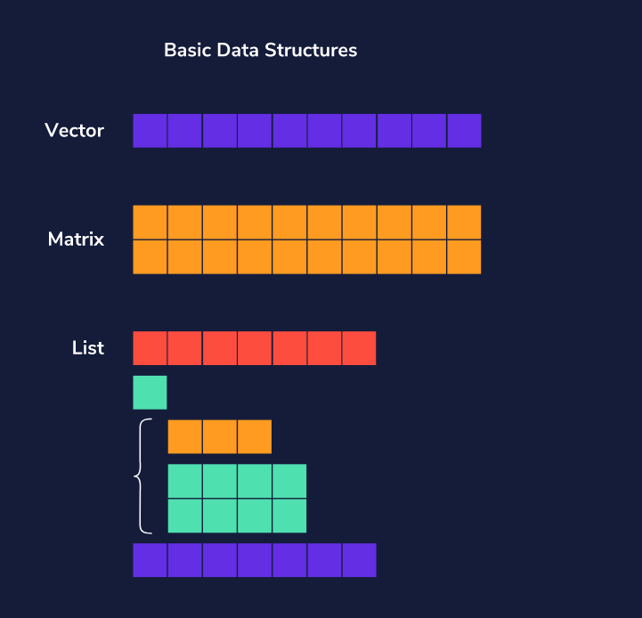
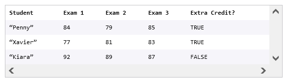
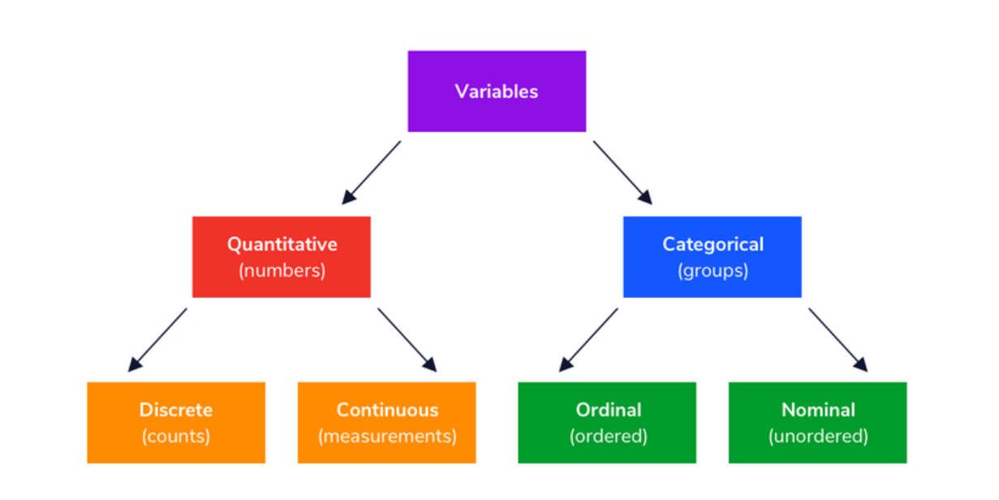

```{r setup, include=FALSE}
knitr::opts_chunk$set(echo = TRUE , cache.lazy = FALSE , warning = FALSE , message = FALSE , fig.width = 8 , fig.height = 5)
```

# Foundations

## Variable declaration : Data

We will generally want to store the things we create for reference later. Simply calculating something does not store it in R. For example, a simple calculation like this can be performed easily

```{r}
3+3
```

As soon as the calculation is complete, it is forgotten by R because the result hasn't been assigned anywhere. To store something in your R session, you will assign it a name using the [`<-`](https://rdrr.io/r/base/assignOps.html) operator. So I can assign my previous calculation to an object called `my_sum`, and this allows me to access the value at any time

```{r}
# store the result
my_sum <- 3+3

# display the stored result
my_sum
```

Look at the "Environment Window" : You will find the variable my_sum

```{r}
# use a variable to declare another variable
# my_new_sum = my_sum + 10
my_new_sum <- my_sum + 10

# view the stored result
my_new_sum
```

Look at the "Environment Window : You will find the variable my_new_sum

## Calculations

Let's start with the basic syntax for mathematical calculations in R. R performs addition, subtraction, multiplication, and division with `+`, `-`, `*`, and `/`:

```{r}
# Results in "500"
573 - 74 + 1
```

```{r}
# Results in "50"
25 * 2
```

```{r}
# Results in "2"
10 / 5
```

Mathematical operations in R follow the standard mathematical [order of operations](https://en.wikipedia.org/wiki/Order_of_operations)

Calculate the result of this equation: `25 * 4 + 9 / 3` in the R code block in your **notebook**

```{r}
# store the result of the calculation in a variable
my_calc <- 25 * 4 + 9 / 3

# view the result
my_calc
```

## Data Types

Now that you know how to calculate basic math and let's dive into how R "thinks about" different types of data. In R and in programming, *data types* are the classifications we give different kinds of information pieces.

1.  *Numeric*: Any number with or without a decimal point: `23`, `0.03`and the numeric null value `NA`.

2.  *Character*: Any grouping of characters on your keyboard (letters, numbers, spaces, symbols, etc.) or text. Most strings are surrounded by single quotes: `' ... '` or double quotes `" ... "`, though we prefer single quotes. Sometimes you will hear this type referred to as "string."

3.  *Logical*: This data type only has two possible values--- either `TRUE` or `FALSE` (without quotes). It's helpful to think of logical types or booleans as on and off switches or as the answers to a "yes" or "no" question.

4.  *Vectors*: A list of related data that is all the same type.

|   Data Type   |    Description     |           Values           |
|:-------------:|:------------------:|:--------------------------:|
|  **Numeric**  | **Numeric Values** |          **11.3**          |
|  **Integer**  | **Integer Values** |           **4**            |
|  **Logical**  | **Boolean Values** | **T/F , TRUE/FALSE , 0/1** |
| **Character** |   **String(s)**    |    **"Ravi" , "3.142"**    |

Note :

-   If a data type is logical expressed as 0 or 1 , default is 0 = FALSE & 1 = TRUE

-   Numerical value inside" " is treated as a Character

# Data Structures

In this lesson, we'll be covering the basic data structures in R: **vectors**, **matrices**, and **lists**.

In all programming languages, data structures are how data gets stored and organized as the code executes. Vectors, matrices, and lists in R each serve their own function.

We'll go through each data structure separately, then review the upsides and downsides of each at the end. We'll also give you a preview of R's frequently used **data frame** -- a data structure that borrows the best features from vectors, matrices, and lists.

{width="554"}

By the end, we'll understand how to use each data structure in our own base R programming.

## Vectors

Vectors are the most basic data structure in R. A vector contains elements of the same type, whether
they're numericals, doubles, characters, logical (`TRUE` or `FALSE`), or complex numbers. Vectors are one-dimensional, meaning they have just one length.

### Create

We create vectors using the function `c()`, separating values inside by commas. Below, we're creating a vector variable called `low_temps` with seven numerical values and a vector called `cities` with 4 character values.

```{r}
# a vector of low temperatures (Fahrenheit) of week
low_temps <- c(35, 36, 29, 30, 31, 33, 30)
 
# a vector of city names
cities <- c("Paris", "Lagos", "Shanghai", "Toronto")

# view the created vectors
low_temps
cities
```

There are two basic built-in functions that can be used with vectors.

-   `length(vec)` returns the number of elements in a vector called `vec`

-   `typeof(vec)` gets the data type of elements in `vec`

```{r}
# length of a vector
length(low_temps)

# type of a vector
typeof(cities)
```

### Read/Access

Vectors are sequential, meaning they keep data in order. The indexing, or the way you refer to the position of the data, starts from 1. We can look up the `i`^th^ element of a vector `v` by calling `v[i]`. Below, we're defining an example vector and accessing elements from it. We'll use this same example vector throughout.

```{r}
example_vector <- c("I", "have", "several", "items", "inside", "me") 
example_vector[1] # gets the first element "I"
example_vector[3] # gets the third element "several"
```

We can also select multiple elements by specifying indices in a vector

```{r}
# select third and fifth element
example_vector[c(3, 5)]
```

Let's break this down. Inside of the `[ ]`, the vector declared by `c(3, 5)` means the individual indexes `3` and `5`. Note that they do not have to be in order.

How would we get the first four elements? We would need a vector that contains the indices `1` through `4`. We know how to make a vector of consecutive integers `1` through `4` using `c(1:4)`. So we'll put that index vector in the bracket like so:

```{r}
# selects the first four elements of the vector
example_vector[c(1:4)]
```

## Factors (Categorical Data Types)

Categorical data---which takes only a finite number of possible values---can be stored as a factor vector to make it easier to perform grouping and manipulation.

We can create a factor variable by allying the factor() method and declaring the values within this method.Notice how we have used the c() operation.

We use the str() method to review the data structure

```{r}
# create a factor variable categories
categories <- factor(
  c("A", "B", "C", "A", "C")
)

# view the structure
str(categories)
```

Notice we have 3 levels

The factors can be assigned an order

```{r}
# character vector 
ranking <- c("Medium", "High", "Low")
str(ranking)
```

We apply the "ordered()" method to the ranking variable and assign the defined levels which are defined in the levels() method

```{r}
# turn it into an ordered factor
ranking_factors <- ordered(
  ranking, levels = c("Low", "Medium", "High")
)

str(ranking_factors)
```

In this case "LOW" \< "MEDIUM" \< "HIGH"

## Matrices

**Matrices** are two-dimensional data structures of the same type and are built from a vector by defining the number of rows and columns. Data is read into the matrix down the columns, starting left and moving right. Matrices are rarely used for non-numeric data types.

See the [R matrix documentation](https://www.rdocumentation.org/packages/base/versions/3.6.2/topics/matrix) for more optional arguments you can use to specify a desired matrix.

### Create

To create a matrix, use the `matrix()` function to specify what the matrix should contain, and how many rows and columns it should have. The `matrix()` function takes three arguments:

-   The first argument should be data you'd like to keep in the matrix. If we specify just one value, the entire matrix will be filled with it. If we specify a vector, R will determine whether it should repeat throughout the matrix or if it fills
    the whole matrix, depending on the vector's length. The vector's data is inserted column-wise by default.

-   `nrow =` number of rows

-   `ncol =` number of columns

```{r}
# create a 2x2 matrix with the first four integers
(m <- matrix(c(1, 2, 3, 4), nrow = 2, ncol = 2))
```

### Read/Access

We can look up individual elements by referring to their row first, then the column in that row. We'll find the element at the `x`^th^ row, `y`^th^ column using `my_matrix[x,y]`.

```{r}
# create a 5X5 matrix
my_matrix <- matrix(c(1:25), nrow = 5, ncol = 5)
my_matrix
```

```{r}
# select the element in the second row, third column (position in the row)
my_matrix[2, 3]
```

```{r}
# select the entire second row as a vector
my_matrix[2, ]
```

```{r}
#select the entire third column as a vector
my_matrix[, 3]
```

## List 

Lists are one-dimensional data structures that can contain multiple data types, unlike vectors. They can also store lists,
meaning there can be lists of lists... of lists.

### Create 

Generally, a list is created using the syntax `my_list <- list(a, b, c)` where `a`, `b`, `c` could be different data types.

```{r}
# create my list
my_list <- list(6, TRUE, "hello")
str(my_list)
```

List elements can be any data type and any dimension. Each element can be given a name

Here is a list of mixed data types : string , numbers and list of lists

```{r}
# list storing a string, two numbers, and a list
my_list <- list("Elephant", 900, 80.3, list("pencil", "pens"))
```

### Read/Access

To access items in a list in R by their position, we can call the index we want in double brackets like so.

**Beware: if we use single bracket notation, like `my_list[1]`, a list object will be returned instead of the value itself.**

```{r}
# access item by position in list
third_item <- my_list[[3]]
print(third_item)
```

Lists are useful as an organizational tool in R because you can label each piece of data inside the list with a name. Instead of having to call the position of the item, you can call it by a name you gave it.
The syntax to create a list with named items inside is `my_list <- list(name1 = a, name2 = b, name3 = b)`

```{r}
# a list that has three vectors named Penny, Xavier, and Kiara
test_scores <- list(Penny = c(84, 79, 85), Xavier = c(89, 90, 82), Kiara = c(92, 89, 87))
test_scores
```

Adding names to the elements stored inside makes it easy to access them by name. To access whatever element has name1, you would ask for `mylist$name1`

```{r}
# get Penny's test scores (vector)
penny_scores <- test_scores$Penny
print(penny_scores)
```

## Special List : Data Frame

Big data sets, especially ones we want to import into our R workspace, take on a common standard: a table
with named columns. We can hold this data in a special form of a list called a **data frame**.

A **data frame** is a table-like list with rows and columns, where each column has a name and each row contains a set of values, one from each column. Data frames are a combination of lists (where you can name things) and matrices
(tabular). They're meant to hold spreadsheet-like data.

Let's think about the list we made last exercise, with Penny, Xavier, and Kiara's test scores. We could organize them into a table with named columns like so:
{width="438"}

### Create

We use the data.frame() method to create a Data Frame from a List of elements

```{r}
# create a data frame
student_scores <- data.frame(
    student = c("Penny", "Xavier", "Kiara"), 
    exam1 = c(84, 77, 92),
    exam2 = c(79, 81, 89),
    exam3 = c(85, 83, 87),
    extra_credit = c(TRUE, TRUE, FALSE)
)

# view the data frame
student_scores
```

```{r}
# two vectors of different types but same length
names <- c("John", "Ayesha")
ages <- c(31, 24)

# create a dataframe
(df <- data.frame(names, ages))
```

```{r}
# get types of columns
str(df)
# get dimensions of df
dim(df)
```

We can use the Tidyverse Package to get a better summary of the structure of a data frame

The glimpse() method gives the data type of each column and dimensions of the Data Frame

```{r}
# load the tidyverse library
library(tidyverse)
# get types of columns
glimpse(df)
```

Most of the time though, data frames are not made from scratch. They're created through importing external CSV (spreadsheet) files or datasets from R packages. Importing data is done through a variety of [R read functions](https://www.rdocumentation.org/packages/utils/versions/3.6.2/topics/read.table).

Let's load a data set that we will use later---the `salespeople` data set, which contains some information on the sales, average customer ratings and performance ratings of salespeople. The [`read.csv()`](https://rdrr.io/r/utils/read.table.html) function can accept a URL address of the file if it is online

```{r}
# url of data set 
url <- "http://peopleanalytics-regression-book.org/data/salespeople.csv"

# load the data set and store it as a dataframe called salespeople
salespeople <- read.csv(url)
```

**Viewing the Data Frame Structure**

```{r}
# view the structural elements of the data frame
glimpse(salespeople)
```

Viewing the Top 6 Rows of the Data Frame

```{r}
# top 6 rows
head(salespeople)
```

Viewing the Bottom 6 Rows

```{r}
# bottom 6 rows
tail(salespeople)
```

# Variable Types

In tabular data (eg., a spreadsheet), variables are represented by the columns of the spreadsheet. The types of variables within our dataset will have a great impact on the insights we can gain from our data. This is why it is important to understand variable types, and how different variables can offer different perspectives and functionalities within our data.

Generally, variables will come in two varieties; categorical and quantitative.

1.  Categorical variables group observations into separate categories that can be ordered or unordered.

2.  Quantitative variables on the other hand are variables expressed numerically, whether as a count or measurement.

{width="427"}

## **Quantitative Variables**

We can think of quantitative variables as any information about an observation that can only be described with numbers. Quantitative variables are generally counts or measurements of something (eg., number of points earned in a game or height).There are two types of quantitative variables; discrete and continuous, and they both help to serve different functions in a dataset.

## **Discrete Variables** 

Discrete quantitative variables are numeric values that represent counts and can only take on integer values. They represent whole units that can not be broken down into smaller pieces, and as such cannot be meaningfully expressed with decimals or fractions. Examples of discrete variables are the number of children in a person's family or the number of coin flips a person makes.

## **Continuous Variables** 

Continuous quantitative variables are numeric measurements that can be expressed with decimal precision. Theoretically, continuous variables can take on infinitely many values within a given range. Examples of continuous variables are length, weight, and age which can all be described with decimal values.

*Sometimes the line between discrete and continuous variables can be a bit blurry. For example, age with decimal values is a continuous variable, but age IN CLOSEST WHOLE YEARS by definition is discrete. The precision with which a quantitative variable is recorded can also determine how we classify the variable*

## **Categorical Variables**

Categorical variables differ from quantitative variables in that they focus on the different ways data can be grouped rather than counted or measured. With categorical variables, we want to understand how the observations in our dataset can be grouped and separated from one another based on their attributes.There are two types of categorical variables : Ordinal and Nominal.

## **Ordinal Variables** 

*When the groupings of a categorical variable have a specific order or ranking , it is an ordinal variable.*\
Suppose there was a variable containing responses to the question "Rate your agreement with the statement: The minimum age to drive should be lowered." The response options are "strongly disagree", "disagree", "neutral", "agree", and "strongly agree".Because we can see an order where "strongly disagree" \< "disagree " \< "neutral" \< "agree" \< "strongly agree" in relation to agreement, we consider the variable to be ordinal

## **Nominal Variables** 

*If there is no apparent order/ranking to the categories of a categorical variable, we refer to to it as a nominal variable.*\
Nominal categorical variables are those variables with two or more categories that do not have any relational order. Examples of nominal categories could be states in the U.S., brands of computers, or ethnicities. Notice how for each of these variables, there is no intrinsic ordering that distinguishes a category as greater than or less than another category.\
*The number of possible values for a nominal variable can be quite large. It's even possible that a nominal categorical variable will take on a unique value for every observation in a dataset, like in the case of unique identifiers such as name or email_address*

## **Binary Variables** 

*Binary or dichotomous variables are a special kind of nominal variable that have only two categories.*\
Because there are only two possible values for binary variables, they are mutually exclusive to one another. We can imagine a variable that describes if a picture contains a cat or a dog as a binary variable. In this case, if the picture is not a dog, it must be a cat, and vice versa. Binary variables can also be described with numbers similar to bits with 0 or 1 values. Likewise you may find binary variables containing boolean values of True or False.

# **Exercise Assessing Variable Types**

An important first step to working with datasets is figuring out what kind of variables (columns in a dataframe) are present, and whether they are quantitative or categorical.

An effective way of taking a peek into our dataframes in is to look at the first few rows of the data. This helps us learn the
variable names within our dataset, and get a sample of the values in each variable, which are invaluable bits of information for us to understand what types of variables we have in our data.

Inspecting our dataset gives us a better understanding of the data that we are working with and the kinds of operations that will be possible, but looking at the data can only tell us so much! Sometimes the variable type of the data may be unclear.

In these cases, we may need to confirm our assessments by inspecting the data dictionary or using domain knowledge. Researching through the associated documentation and a little domain knowledge can often save us from any false assumptions we may have made about our dataset.

Let's practice inspecting a dataset to identify its variable types by working with the movies dataframe which is composed of the television shows and movies hosted on the Netflix platform in 2019.

```{r}
# load library
library(tidyverse)
```

```{r}
# load the data
data = read.csv("DATASETS/movie_data_netflix.csv")
```

```{r}
# view data structure
glimpse(data)
```

**Categorical Variables**

The rating variable describes the Motion Picture Association Film Rating Board rating for each film and the TV Parental Guidelines Monitoring Board rating for each television show. The ratings have been consolidated for simplicity.

**Question : Identify whether the rating variable is quantitative or categorical?**\
**Answer : Rating is a "Categorical Variable" as is evident from the "different categories of movie ratings".**

Suppose that you've looked at the first few rows of your data and established that a variable is categorical. An important next step is to determine whether the categories are ordered or not.\
We can use **unique() method with the column** to view the unique values to further inspect their data types

```{r}
# unique countries
unique(data$country)
```

**Question : Identify whether the country column is ordinal or nominal**\
**Answer : Nominal , given that there is no specific order**

```{r}
# unique ratings
unique(data$rating)
```

**Quantitative Variables**\
As with categorical variables, it is important to closely examine quantitative variables in a dataset and understand what they are measuring. There are two different types of quantitative variables:

1.  Discrete quantitative variables are counts, so they should be whole numbers (no decimals)

2.  Continuous quantitative variables are measurements so they should be decimals (look for those values that are measured and in decimal form)

```{r}
# sample any 10 rows of the data
sample_n(data , 10)
```

**Question : Identify the type of "Release Year"**\
**Answer : Release Year is a "discrete numerical variable" since these are countable.**

**Question : Identify the type of "Duration"**\
**Answer : Duration is a "continuous numerical variable" since this is in decimals and cannot be easily counted**
