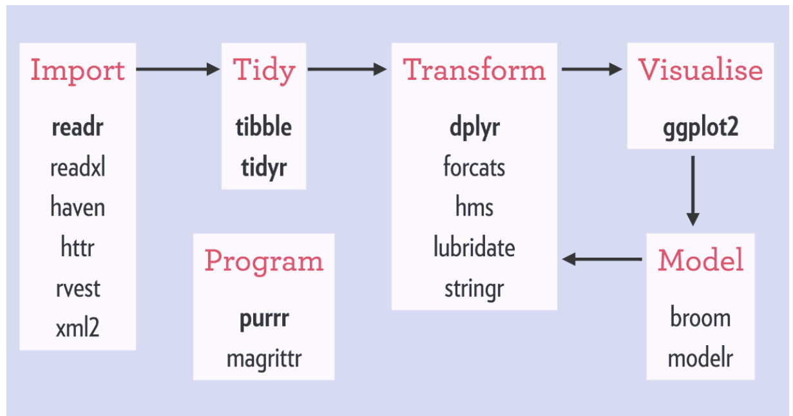
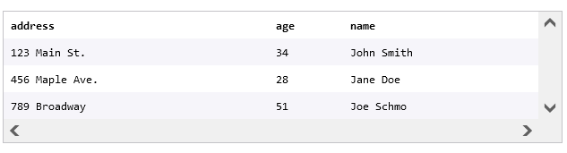

```{r setup, include=FALSE}
knitr::opts_chunk$set(echo = TRUE , cache.lazy = FALSE , warning = FALSE , message = FALSE , fig.width = 8 , fig.height = 5)
```

# Tidyverse

The tidyverse is a coherent system of packages for data manipulation,
exploration and visualization that share a common design philosophy.
Tidyverse packages are intended to make statisticians and data
scientists more productive by guiding them through workflows that
facilitate communication, and result in reproducible work products.
Fundamentally, the tidyverse is about the connections between the tools
that make the workflow possible.You can find the current state of
development at [tidyverse.org](http://tidyverse.org/). The following
figure illustrates a canonical data science workflow, and shows how the
individual packages fit in. {width="537"}

# The dplyr package

The dplyr package provides functions that perform data manipulation
operations oriented to explore and manipulate datasets. At the most
basic level, the package functions refers to data manipulation "verbs"
such as select, filter, mutate, arrange, summarize among others that
allow to chain multiple steps in a few lines of code. The dplyr package
is suitable to work with a single dataset as well as to achieve complex
results in large datasets

***Note : When you load the "tidyverse"package , all the associated
;libraries listed above are loaded.***

***We can then call specific functions/methods from each library without
the need of explicitly loading them.***

```{r}
# load library
library(tidyverse)
```

# Key Concepts

## What is a Data Frame

A data frame is an R object that stores tabular data in a table
structure made up of rows and columns. You can think of a data frame as
a spreadsheet or as a SQL table. While data frames can be created in R,
they are usually imported with data from a CSV, an Excel spreadsheet, or
a SQL query.

Data frames have rows and columns. Each column has a name and stores the
values of one variable. Each row contains a set of values, one from each
column. The data stored in a data frame can be of many different types:
numeric, character, logical, or NA.

A data frame containing the address, age and name of students in a class
could look like this:



As seen in the first row, the column names of this data frame are
`address`, `age`, and `name`.

Note: when working with `dplyr`, you might see functions that take a
data frame as an argument and output something called a tibble. Tibbles
are modern versions of data frames in R, and they operate in essentially
the same way. The terms tibble and data frame are often used
interchangeably.

## CSVs

When working with data frames, most of the time you will load in data
from an existing data set. One of the most common formats for big
datasets is the *CSV*.

*CSV (comma separated values)* is a text-only spreadsheet format. You
can find CSVs in lots of places such as:

-   online datasets from governments and companies (here's an example
    from [data.gov](https://catalog.data.gov/dataset?res_format=CSV))

-   exported from Excel or Google Sheets

-   exported from SQL

The first row of a CSV contains column headings. All subsequent rows
contain values. Each column heading and each variable is separated by a
comma:

    column1,column2,column3
    value1,value2,value3
    value4,value5,value6

That example CSV represents the following table:

| column1 | column2 | column3 |
|---------|---------|---------|
| value1  | value2  | value3  |
| value4  | value5  | value6  |

## Loading and Saving CSVs

When you have data in a CSV, you can load it into a data frame in R
using `readr`'s `read_csv()` function:

    df <- read_csv('my_csv_file.csv')

-   In the example above, the `read_csv()` function is called

-   The CSV file `my_csv_file.csv` is passed in as an argument

-   A data frame containing the data from `my_csv_file.csv` is returned

You can also save data from a data frame to a CSV using `readr`'s
`write_csv()` function:

    write_csv(df,'new_csv_file.csv')

In the example above, `write_csv()` takes two arguments:

-   `df`, which represents a data frame object

-   `new_csv_file.csv`, the name of the CSV file that will hold the data
    from the data frame

By default, this method will save the CSV file to your current
directory.

`artists.csv` contains data from the top 7 most popular music groups of
2018. Let us load the CSV into a data frame `artists`. and view the
rendered data frame.

```{r}
artists <- read.csv("DATASETS/artists.csv")
head(artists)
```

# Inspecting Data Frames

When you load a new data frame from a CSV, you want to get an
understanding of what the data looks like.

If the data frame is small, you can display it by typing its name `df`.
If the data frame is larger, it can be helpful to inspect a few rows of
the data frame without having to look at the rest of it.

The `head()` function returns the first 6 rows of a data frame. If you
want to see more rows, you can pass an additional argument `n` to
`head()`. For example, `head(df,8)` will show the first `8` rows.

The function `summary()` will return summary statistics such as mean,
median, minimum and maximum for each numeric column while providing
class and length information for non-numeric columns.

```{r}
# inspect top 6 rows
head(artists)
```

```{r}
# inspect the structure
glimpse(artists)
```

```{r}
# summary statistics
summary(artists)
```

# Piping

One of the most appealing aspects of dplyr is the ability to easily
manipulate data frames. Each of the dplyr functions you will explore
takes a data frame as its first argument.

The *pipe operator*, or `%>%`, helps increase the readability of data
frame code by piping the value on its left into the first argument of
the function that follows it. For example:

    df %>%
    head()

pipes the data frame `df` into the first argument of `head()`, becoming

    head(df)

The true power of pipes comes from the ability to link multiple function
calls together. Once you learn some of dplyr's functions, we'll revisit
pipes and see how they are so useful!

Note: the pipe operator is *not* a part of base R. It comes from the
`magrittr` package, but do not worry about loading magrittr in your
code. Any time you load a package from the tidyverse, like dplyr, `%>%`
will automatically be loaded!

```{r}
# inspect data frame with pipe
artists %>%
head()
```

# Selecting Columns

The `select()` function of dplyr package is used to choose which columns
of a data frame you would like to work with. It takes column names as
arguments and creates a new data frame using the selected columns
Suppose you have a data frame called `customers`, which contains the
ages of your business's customers:

| name            | age | gender |
|-----------------|-----|--------|
| Rebecca Erikson | 35  | F      |
| Thomas Roberson | 28  | M      |
| Diane Ochoa     | 42  | NA     |

For your analysis, you only care about the age and gender of your
customers, not their names. The data frame you want looks like this:

| age | gender |
|-----|--------|
| 35  | F      |
| 28  | M      |
| 42  | NA     |

You can select the appropriate columns for your analysis using `dplyr`'s
`select()` function:

    select(customers,age,gender)

-   `select()` takes a data frame as its first argument

-   all additional arguments are the desired columns to select

-   `select()` returns a new data frame containing only the desired
    columns

But what about the pipe `%>%`, you ask? Great question. You can simplify
the readability of your code by using the pipe:

    customers %>%
            select(age,gender)

When using the pipe, you can read the code as: from the `customers`
table, `select()` the `age` and `gender` columns. From now on we will
use the pipe symbol where appropriate to simplify our code.

**Select the `group` column of `artists` using `select()` and save the
result to `artist_groups`. View `artist_groups`.**

```{r}
# select one column
artist_groups <- artists %>% 
    select(group)

# view the new data frame
artist_groups
```

Select the `group`, `spotify_monthly_listeners`, and `year_founded`
columns of `artists` using `select()` and save the result to
`group_info`. View `group_info`.

```{r}
# select multiple columns
# create new data frame by selecting multiple columns
group_info <- artists %>%
    select(group , spotify_monthly_listeners , year_founded)

# view the new data frame
group_info
```

# Excluding Columns

To exclude columns, add the `-` operator before the name of the column
or columns when passing them as an arguments to select(). This will
return a new data frame with all columns except ones preceded by a `-`
operator

Sometimes rather than specify what columns you want to select from a
data frame, it's easier to state what columns you do not want to select.
`dplyr`'s `select()` function also enables you to do just that!

Consider a `customers` data frame that contains biographical information
for the customers of your business:

You are interested in analyzing where your customers live and how old
they are. For your analysis, you do not care about the `name` and
`phone` associated with a customer, only their `address` and `age`. To
exclude the columns you do not need:

    customers %>%
              select(-name,-phone)

-   the data frame `customers` is piped into `select()`

-   the columns to remove, prepended with a `-`, are given as arguments

-   a new data frame without the `name` and `phone` columns is returned

**Select all columns of `artists` except `albums` using `select()` and
save the result to `no_albums`. View `no_albums`.**

```{r}
# select all columns except one
no_albums <- artists %>%
select(-albums)

# view the new data frame
no_albums
```

**Select all columns of `artists` except `genre`,
`spotify_monthly_listeners`, and `year_founded` using `select()` and
save the result to `df_cols_removed`. View `df_cols_removed`.**

```{r}
# select all columns except a set
df_cols_removed <- artists %>%
select(-genre, -spotify_monthly_listeners,-year_founded)

# view the new data frame
df_cols_removed
```

# Filtering Rows

The filter() function can subset rows of a data frame based on logical
operations of certain columns. The condition of the filter should be
explicity passed as a parameter of the function with the following
syntax: name of the column, operator(\<,==,\>,!=) and value. On the
other hand is possible to chain conditions within a column or on
different columns using logical operators such as boolean
operators(&,\|,!).

## Filtering Rows with Logic I

The `filter()` function of the dplyr package allows users to select a
subset of rows in a data frame that match with certain conditions that
are passed as arguments. The first argument of the function is the data
frame and the following arguments are the conditional expressions that
serve as the `filter()` criteria

In addition to subsetting a data frame by columns, you can also subset a
data frame by rows using dplyr's `filter()` function and comparison
operators! Consider an `orders` data frame that contains data related to
the orders for an e-commerce shoe company:

| id    | first_name | last_name | email                                                                | shoe_type    | shoe_material | shoe_color | price |
|-------|------------|-----------|----------------------------------------------------------------------|--------------|---------------|------------|-------|
| 54791 | Rebecca    | Lindsay   | [RebeccaLindsay57\@hotmail.com](mailto:RebeccaLindsay57@hotmail.com) | clogs        | faux-leather  | black      | 22    |
| 53450 | Emily      | Joyce     | [EmilyJoyce25\@gmail.com](mailto:EmilyJoyce25@gmail.com)             | ballet flats | faux-leather  | navy       | 32    |
| 91987 | Joyce      | Waller    | [Joyce.Waller\@gmail.com](mailto:Joyce.Waller@gmail.com)             | sandals      | fabric        | black      | 12    |
| 14437 | Justin     | Erickson  | [Justin.Erickson\@outlook.com](mailto:Justin.Erickson@outlook.com)   | clogs        | faux-leather  | red        | 22    |

Let's say you want to find all orders made by customers with the first
name `'Joyce'`.

    orders %>%
              filter(first_name == 'Joyce')

-   the `orders` data frame is piped into `filter()`

-   the condition `first_name == 'Joyce'` is given as an argument

-   a new data frame containing only the rows where
    `first_name == 'Joyce'` is returned

What if you have multiple conditions you want to be met? Not a problem!
To find all orders made of faux-leather **AND** costing more than 25:

    orders %>%
            filter(shoe_material == 'faux-leather',price > 25)

-   the `orders` data frame is again piped into `filter()`

-   the conditions `shoe_material == 'faux-leather'` **and**
    `price > 25` are given as arguments

-   a new data frame containing only the rows where both conditions were
    met is returned

You can provide any number of conditions that you please, as long as you
separate each condition by a comma as its own argument. Note: each
condition that you list must be met for a row to be returned!

**Filter the rows of `artists` where the genre is `'Rock'` and save the
result to `rock_groups`. View `rock_groups`.**

```{r}
# filter rows one condition
rock_groups <- artists %>%
    filter(genre == "Rock")

# view the result
rock_groups
```

**Filter the rows of `artists` where the genre is
`'Rock'`*and*`spotify_monthly_listeners` is greater than `20000000`.
Save the result to `popular_rock_groups`, and view it.**

```{r}
# filter rows multiple conditions
popular_rock_groups <- artists %>%
    filter(genre == "Rock" , 
           spotify_monthly_listeners > 20000000)

# view the result
popular_rock_groups
```

## Filtering Rows with Logic II

The `filter()` function also allows for more complex filtering with the
help of logical operators! Take a look at the same `orders` data frame :

| id    | first_name | last_name | email                                                                | shoe_type    | shoe_material | shoe_color | price |
|-------|------------|-----------|----------------------------------------------------------------------|--------------|---------------|------------|-------|
| 54791 | Rebecca    | Lindsay   | [RebeccaLindsay57\@hotmail.com](mailto:RebeccaLindsay57@hotmail.com) | clogs        | faux-leather  | black      | 22    |
| 53450 | Emily      | Joyce     | [EmilyJoyce25\@gmail.com](mailto:EmilyJoyce25@gmail.com)             | ballet flats | faux-leather  | navy       | 32    |
| 91987 | Joyce      | Waller    | [Joyce.Waller\@gmail.com](mailto:Joyce.Waller@gmail.com)             | sandals      | fabric        | black      | 12    |
| 14437 | Justin     | Erickson  | [Justin.Erickson\@outlook.com](mailto:Justin.Erickson@outlook.com)   | clogs        | faux-leather  | red        | 22    |

You are interested in seeing all orders that were for `'clogs'` **OR**
that cost less than `20`. Using the or operator (`|`):

    orders %>%
           filter(shoe_type == 'clogs' |price < 20)

-   the `orders` data frame is piped into `filter()`

-   the compound conditional statement `shoe_type == 'clogs'` *OR*
    `price < 20` is given as an argument

-   a new data frame is returned containing only rows where `shoe_type`
    is `'clogs'` *or* `price` is less than `20`

What if you want to find all orders where shoes in any color **but** red
were purchased. Using the not or bang operator (`!`):

    orders %>%
              filter(!(shoe_color == red))

-   `orders` is again piped into `filter()`

-   the condition that should *not* be met is wrapped in parentheses,
    preceded by `!`, and given as an argument to `filter()`

-   a new data frame is returned containing only rows where `shoe_color`
    is not `'red'`

**Filter the rows of `artists` where the country is `'South Korea'`*or*
the `year_founded` is before `2000`. Save the result to
`korea_or_before_2000`, and view it.**

```{r}
# filter rows with or
korea_or_before_2000 <- artists %>%
    filter(country == "South Korea" | 
               year_founded < 2000)
# view the result
korea_or_before_2000
```

**Filter the rows of `artists` where the genre is *not*`'Rock'`. Save
the result to `not_rock_groups`, and view it.**

```{r}
# filter rows with not !
not_rock_groups <- artists %>%
    filter(!(genre == "Rock"))

# view the result
not_rock_groups
```

# Arranging Rows

The `arrange()` function of the dplyr package orders the rows of a data
frame based on the values of a column or a set of columns that are
passed as parameters. The resulting order of the data frame can be in
ascending or descending order. By default `arrange()` orders the
dataframe in ascending order, but it is possible to change this and
order the data frame in descending order using the `desc()` parameter
over the column.

Sometimes all the data you want is in your data frame, but it's all
unorganized! Step in the handy dandy dplyr function `arrange()`!
`arrange()` will sort the rows of a data frame in ascending order by the
column provided as an argument.

For numeric columns, ascending order means from lower to higher numbers.
For character columns, ascending order means alphabetical order from A
to Z.

Let's look back at the `customers` data frame for your company:

To arrange the customers in ascending order by name:

    customers %>%
                 arrange(name)

-   the `customers` data frame is piped into `arrange()`

-   the column to order by, `name`, is given as an argument

-   a new data frame is returned with rows in ascending order by `name`

`arrange()` can also order rows by descending order! To arrange the
customers in descending order by age:

    customers %>%
                  arrange(desc(age))

-   the `customers` data frame is again piped into `arrange()`

-   the column to order by, `age`, is given as an argument to `desc()`,
    which is then given as an argument to `arrange()`

-   a new data frame is returned with rows in descending order by `age`

If multiple arguments are provided to `arrange()`, it will order the
rows by the column given as the first argument and use the additional
columns to break ties in the values of preceding columns.

**Arrange the rows of `artists` in *ascending* order by `group`. Save
the result to `group_asc`, and view it.**

```{r}
# arrange rows in ascending order
group_asc <- artists %>%
    arrange(group)

# view the result
group_asc
```

**Arrange the rows of `artists` in *descending* order by
`youtube_subscribers`. Save the result to `youtube_desc`, and view it.**

```{r}
# arrange rows in descending order
youtube_desc <- artists %>% 
    arrange(desc(youtube_subscribers))

# view the result
youtube_desc
```

Select Columns except (country,year_founded,albums).

Filter spotify_monthly_listeners \> 20000000,

Filter all genres except 'Hip Hop'.

Arrange descending order of youtube subscribers

```{r}
# select columns, filter and arrange rows
new_artists <- artists %>% 
  # Select all columns of artists except country,year_founded,albums
  select(-country,-year_founded,-albums) %>% 
  # Filter spotify > 2M and Genres except HipHop
  filter(spotify_monthly_listeners > 20000000, genre != 'Hip Hop') %>% 
  # Arrange descending order of youtube listeners  
  arrange(desc(youtube_subscribers))

# view 
new_artists
```

# Modifying Data Frames

When working with data frames, you often need to modify the columns for
your analysis at hand. With the help of the dplyr package, data frame
modifications are easily performed.

Data from the [American Kennel Club (AKC)](https://www.akc.org/) will be
loaded into a data frame. The data covers two categories of dog data:

-   [dog breed size](https://data.world/len/dog-canine-breed-size-akc),
    including lower and upper bounds for height (inches) and weight
    (pounds)

-   [dog breed
    popularity](https://data.world/len/akc-popular-dog-breeds),
    including popularity ranks from 2013, 2014, 2015 and 2016

## Adding a Column

The `mutate()` function from dplyr package adds new columns to an
existing data frame based on a transformation of an existing column,
while maintaining all the other columns. The function receives the data
frame as the first parameter,
and subsequently specify the new column name followed by the `=`
operator and a transformation function. After the first variable
parameter, further parameters can be added to mutate more variables at
the same time.

Sometimes you might want to add a new column to a data frame. This new
column could be a calculation based on the data that you already have.

Suppose you own a hardware store called The Handy Woman and have a data
frame containing inventory information:

| product_id | product_description | cost_to_manufacture | price |
|------------|---------------------|---------------------|-------|
| 1          | 3 inch screw        | 0.50                | 0.75  |
| 2          | 2 inch nail         | 0.10                | 0.25  |
| 3          | hammer              | 3.00                | 5.50  |
| 4          | screwdriver         | 2.50                | 3.00  |

You can add a new column to the data frame using the `mutate()`
function. `mutate()` takes a name-value pair as an argument. The name
will be the name of the new column you are adding, and the value is an
expression defining
the values of the new column in terms of the existing columns.
`mutate()` returns a new data frame with the added column.

Maybe you want to add a column to your inventory table with the amount
of sales tax that is charged for each item. The following code
multiplies each `price` by `0.075`, the sales tax in your state:

    df %>%
        mutate(sales_tax = price *0.075)

Now the inventory table has a column called `sales_tax`, where the value
is `0.075 * price`:

| product_id | product_description | cost_to_manufacture | price | sales_tax |
|------------|---------------------|---------------------|-------|-----------|
| 1          | 3 inch screw        | 0.50                | 0.75  | 0.06      |
| 2          | 2 inch nail         | 0.10                | 0.25  | 0.02      |
| 3          | hammer              | 3.00                | 5.50  | 0.41      |
| 4          | screwdriver         | 2.50                | 3.00  | 0.22      |

The data from the American Kennel Club on dog breed size and popularity
needs to be loaded into a data frame `dogs`.

Inspect the data frame using `head()`. Make sure to click the arrows in
the rendered notebook to explore each column of the data frame.

```{r}
dogs <- read.csv("DATASETS/dogs_data.csv")
head(dogs)
```

Add a new column to `dogs` named `avg_height` that is the average of
`height_low_inches` and `height_high_inches`. Save this new data frame
to `dogs`.

Use `head()` to inspect the new data frame, and use the arrows to
navigate to the last column of the data frame, which will now be
`avg_height`.

```{r}
# add average height column
dogs <- dogs %>%
    mutate(avg_height = (height_low_inches + height_high_inches)/2)

# inspect the new data frame
head(dogs)
```

## Adding Multiple Columns

Let's refer back to the inventory table for your store, The Handy Woman.

| product_id | product_description | cost_to_manufacture | price | sales_tax |
|------------|---------------------|---------------------|-------|-----------|
| 1          | 3 inch screw        | 0.50                | 0.75  | 0.06      |
| 2          | 2 inch nail         | 0.10                | 0.25  | 0.02      |
| 3          | hammer              | 3.00                | 5.50  | 0.41      |
| 4          | screwdriver         | 2.50                | 3.00  | 0.22      |

You want to add two more new columns to your table. One column will
contain the profit made from selling each item
(`price - cost_to_manufacture`), and the other will state whether the
item is currently in stock (suppose every item is currently in stock).

`mutate()` can take multiple arguments to add any number of new columns
to a data frame:

    df %>%
        mutate(profit = price - cost_to_manufacture,
                in_stock = TRUE)

-   `mutate()` takes two arguments, defining new columns `profit` and
    `in_stock`

-   `profit` is equal to `price` minus `cost_to_manufacture`

-   `in_stock`, rather than be derived from values in existing columns,
    is given the value `TRUE` for all rows

The inventory table will now look like this:

+-------+---------+---------+---------+---------+---------+---------+
| produ | produ   | cost_   | price   | sa      | profit  | i       |
| ct_id | ct_desc | to_manu |         | les_tax |         | n_stock |
|       | ription | facture |         |         |         |         |
+=======+=========+=========+=========+=========+=========+=========+
| 1     | 3 inch  | 0.50    | 0.75    | 0.06    | 0.25    | TRUE    |
|       | screw   |         |         |         |         |         |
+-------+---------+---------+---------+---------+---------+---------+
| 2     | 2 inch  | 0.10    | 0.25    | 0.02    | 0.15    | TRUE    |
|       | nail    |         |         |         |         |         |
+-------+---------+---------+---------+---------+---------+---------+
| 3     | hammer  | 3.00    | 5.50    | 0.41    | 2.5     | TRUE    |
+-------+---------+---------+---------+---------+---------+---------+
| 4     | scre    | 2.50    | 3.00    | 0.22    | 0.5     | TRUE    |
|       | wdriver |         |         |         |         |         |
+-------+---------+---------+---------+---------+---------+---------+

Use `mutate()` to add a new column `avg_weight` that is the average of
`weight_low_lbs` and `weight_high_lbs`.

Use `head()` to inspect the new data frame.

```{r}
# add average height, average weight and rank change columns
dogs <- dogs %>%
  mutate(avg_height = (height_low_inches + height_high_inches)/2) %>% 
  mutate(avg_weight = (weight_low_lbs + weight_high_lbs)/2)
# inspect the new data frame
head(dogs)
```

You want to see how the popularity of dog breeds has changed from `2013`
to `2016`. The change in rank can be calculated by subtracting the
earlier rank from the later rank.

Use `mutate()` to add a new column `rank_change_13_to_16` that is the
change in rank from `2013` to `2016` (`rank_2016 - rank_2013`).

```{r}
# add average height, average weight and rank change columns
dogs <- dogs %>%
  mutate(avg_height = (height_low_inches + height_high_inches)/2) %>% 
  mutate(avg_weight = (weight_low_lbs + weight_high_lbs)/2) %>%
  mutate(rank_change_13_to_16 = rank_2016 - rank_2013)
# inspect the new data frame
head(dogs)
```

## Rename Columns

The `rename()` function of *dplyr* package can be used to change the
column names of a data frame. It has a
simple syntax where it is necessary to pass the new name followed by the
`=` operator and the old name of the column. On the other hand to rename
multiple columns based on logical criteria, the `rename()` function has
variants such as `rename_if()`, `rename_at()` and `rename_all()`.

Since dplyr functions operate on data frames using column names, it is
often useful to update the column names of a data frame so they are as
clear and meaningful as possible. dplyr's `rename()` function allows you
to easily do this.

Say you have a data frame of books, as shown in the table below:

| name                                     | written_by               |
|------------------------------------------|--------------------------|
| The Lord of the Rings                    | J. R. R. Tolkien         |
| Le Petit Prince                          | Antoine de Saint-Exupery |
| Harry Potter and the Philosopher's Stone | J. K. Rowling            |

`rename()` can take any number of arguments, where each new column name
is assigned to replace an old column name in the format
`new_column_name = old_column_name`. `rename()` returns a new data frame
with the updated column names.

To update the `name` column to `book_title` and the `written_by` column
to `author`:

    f %>%
        rename(book_title = name,
               author = written_by)

You can confirm the names of the columns have been updated using either
of the base R functions `names()` or `colnames()`, which take a data
frame as an argument and return a vector containing the column names

Update the name of `avg_height` to `avg_height_inches`, `avg_weight` to
`avg_weight_lbs`, and `rank_change_13_to_16` to
`popularity_change_13_to_16`. Save the updated data frame to `dogs`.

```{r}
dogs <- dogs %>% 
    rename(avg_height_inches = avg_height , 
           avg_weight_lbs = avg_weight , 
           popularity_change_13_to_16 = rank_change_13_to_16)
# view column names
colnames(dogs)
```
