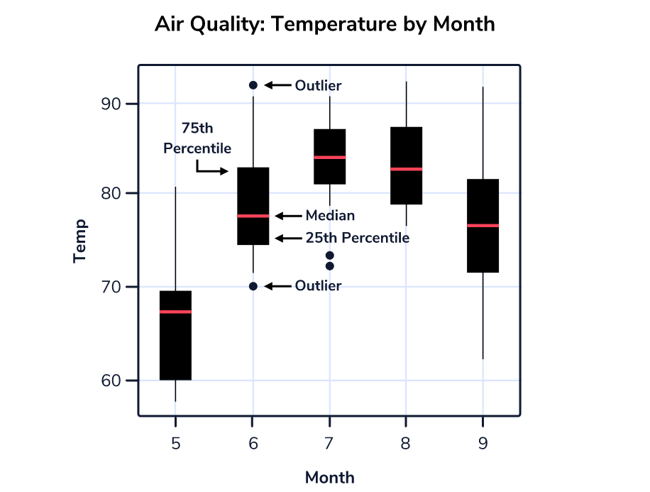

```{r setup, include=FALSE}
knitr::opts_chunk$set(echo = TRUE , cache.lazy = FALSE , warning = FALSE , message = FALSE , fig.width = 10 , fig.height = 5)
```

# Libraries

```{r}
library(tidyverse) # data manipulation
library(tidyquant) # advanced visualizations
library(lubridate) # manipulating dates
```

# Basic Steps

-   Bind a data frame to a plot (Data Preparation)

-   Select variables to be plotted and variables to define the presentation such as size, shape, color, transparency, etc. by defining aesthetics (aes)

-   Add a graphical representation of the data in the plot (points, lines, bars) adding "geoms" layers

-   Produce univariate plots, barplots and histograms, area plots, boxplots, and line plots, using ggplot.

-   Produce bivariate plots, like scatter plots, hex plots, stacked bars, and bivariate line charts using ggplot.

-   Modify the aesthetics for the entire plot as well as for individual "geoms" layers

-   Modify plot elements (labels, text, scale, orientation)

-   Group observations by a factor variable

-   Break up plot into multiple panels (facetting)

-   Apply ggplot themes and create and apply customized themes

-   Save a plot created by ggplot as an image

# First Visualization :

**Goal : Visualize Revenue by Year for various Bike categories**

## Step 1 : Loading the data

```{r}
# load the bike orderlines data into a dataframe
bike_orderlines_tbl <- read_rds("bike_orderlines.rds")
glimpse(bike_orderlines_tbl)
```

## Step 2 : Format the data {Get the data in the right format for visualization}

[**Key to a good ggplot is knowing how to format the data**]{.ul}

We need to visualize Total Revenue By Year so we need table that has "Year" and "Total Revenue Columns".

We need to first prepare a dataframe that contains these columns from the available data

We will select the "order-date" and "total-price" columns

Group the "total-price" by year and "sum" the prices to get "total revenue by year"

Store this extracted data into a new dataframe

```{r}
revenue_by_year <- bike_orderlines_tbl %>%
    # select the order date and total price
    select(order_date , total_price) %>%
    # add a column year which is year converted
    mutate(year = year(order_date)) %>%
    # group the total price by new column year
    group_by(year) %>%
    # summarize the data and add a clumn revenue
    summarize(revenue = sum(total_price)) %>%
    # ungroup
    ungroup()

glimpse(revenue_by_year)
```

## Step 3 : Create the Visualization {Visual representation of tabulated data to extract insights}

```{r}
# load the plot into an object
g <- revenue_by_year %>%
    
    # Canvas : x and y 
    ggplot(aes(x = year, y = revenue)) + 
    
    # Geometries : plot type
    geom_line() +
    
    # Formatting : formatting 
        labs(
        title = "Revenue",
        subtitle = "Sales are trending up and to the right!"
        ) +
    theme_tq()

# View the plot
g
```

# Geometries : Types of Plots

## Scatter Plot : Continuous X and Continuous Y geom_point()

**Goal : Explain relationship between order value and quantity of bikes sold (O.V. v/s O.Qty)**

***Scatterplots are great for graphing paired numerical data or to detect a correlation between two variables***

A popular layer that allows you to eye patterns in the data by completing a line of best fit is the `geom_smooth()` layer. This layer, by nature, comes with a gray error band. Most commonly used method within geom_smooth is method = "lm" which adds a "Linear Regression Line".

**Step 1 : Format the data for the desired visualization**

We need the total order quantity and total order value per order id

We will select only the relevant columns from the master dataframe

We will group by "order-id" and then summarize the data and store it in "total value" and "total quantity"

```{r}
bike_ov_oq <- bike_orderlines_tbl %>%
    # select the desired columns from the main dataframe
    select(order_id , order_line , total_price , quantity) %>%
    # group by order id since one order id has multiple lines
    group_by(order_id) %>%
    # summarize into new columns
    summarize(
        total_qty    = sum(quantity) , 
        total_value  = sum(total_price)
    ) %>%
    # ungroup
    ungroup()

glimpse(bike_ov_oq)
```

**Step 2 : Create the visualization to derive insights**

```{r}
# Load the plot into an object
g <- bike_ov_oq %>%
    # Canvas/Aesthetics : x and y 
    ggplot(aes(x = total_qty, y = total_value)) +
    
    # Geometry : alpha for transparency and size of differentiation
    geom_point(alpha = 0.5 , size = 2) +
    
    # Add the linear trend line : linear regression
    geom_smooth(method = "lm") +
    
    # Add a theme in this case "tidy quant"
    theme_tq()

# View the plot
g
```

**Inference :**

1.  As the Total Quantity Increases , So does the Total Value... Linear Relationship
2.  There is a Higher Concentration of orders with Total Quantity is \< 20 ... Darker Points b/w 0 and 20

## Line Plot : Change over Time (Time-Series)

**Goal : Describe revenue by Month, expose cyclic nature**

**Step 1 : Format the data for the desired visualization**

We need the total revenue by month

We will select only the relevant columns from the master dataframe (order_date , total_price)

We will convert the order date to "year_month" then group by "year_month"

We will use the floor_date function to round off the dates to "months"

We will then group by month and summarize revenue and store it in rev_by_month

```{r}
bike_rev_mth <- bike_orderlines_tbl %>%
    # select the order date and price
    select(order_date , total_price) %>%
    # add a column year_moth applying the floor_date function from lubridate
    # we will select the conversion to months
    mutate(year_month = floor_date(order_date , "months") %>%
    # convert to date time format
    ymd()) %>%
    # group by month
    group_by(year_month) %>%
    # summarize revenue by mnth
    summarize(revenue = sum(total_price)) %>%
    # ungroup()
    ungroup()

# view
glimpse(bike_rev_mth)
```

**Step 2 : Create the visualization to derive insights**

```{r}
bike_rev_mth %>%
    # Canvas/Aesthetics : x and y
    ggplot(aes(x = year_month , y = revenue)) +
    
    # Geometry : alpha for transparency and span for line type for type
    geom_line(alpha = 0.5 , linetype = 1) +
    
    # Add the trend line : loess polynomial regression
    geom_smooth(span = 0.2) +
    
    # Add a theme in this case "tidy quant"
    theme_tq()
```

**Inference :**

There is a seasonal and cyclical pattern in sales every year (some months have higher sales , some have lower)

## Bar and Column Plot : Summarize Categories (Categorical X , Continuous Y)

Bar charts are great for showing the distribution of categorical data. Typically, one of the axes on a bar chart will have numerical values and the other will have the names of the different categories you wish to understand.

Note :

geom_col() : use this geometry for univariate visualization i.e. count of a single category (catX)

geom_bar() : use this geometry for bivariate visualization i.e. catX and contY

**Goal: Sales by Descriptive Category**

**Step 1 : Format the data for the desired visualization**

We need the total revenue by descriptive category i.e. category_2

We will select only the relevant columns from the master dataframe (category_2 , total_price)

We will convert the group the data by category_2 and summarize revenue and store it in rev_by_cat

```{r}
rev_by_cat <- bike_orderlines_tbl %>%
    # select the desired columns
    select(category_2 , total_price) %>%
    # group by category
    group_by(category_2) %>%
    # summarize revenue
    summarize(revenue = sum(total_price))

rev_by_cat
```

**Step 2 : Create the visualization to derive insights**

```{r}
rev_by_cat %>%
    # Canvas/Aesthetics : x and y
    ggplot(aes(x = category_2 , y = revenue)) +
    
    # Geometry : alpha for transparency and span for line type for type
    geom_col() +

    # Add a theme in this case "tidy quant"
    theme_tq()
```

Let us re-order the data in descending order of revenue and convert to horizontal bars

Step 1 : Re-order category column by revenue : convert category to factor

Step 2 : Apply fct_reorder (revenue) method to re-order

Step 3 : Plot the bar chart with Revenue on Y and

```{r}
rev_by_cat %>%
    # add a column cat_reord with categories as factor
    mutate(category_2 = category_2 %>% as.factor() %>%
    # reorder by revenue descending
    fct_reorder(revenue)) %>%
    # Canvas/Aesthetics : x and y
    ggplot(aes(x = category_2 , y = revenue)) +
    # Geometry : geom_col since we have two variables
    geom_col(fill = "#2c3e50") + ## change the color of the bars
    # flip the axes
    coord_flip() +
    # Theme
    theme_tq()
```

## Histogram/Density : Distribution of Continuous (Continuous X / Cont.Y by Cat. X)

Histograms let us visualize the distribution of a continuous variable, in contrast to bar plots which show counts and other values for discrete and categorical variables. Histograms divide values of a variable into bins, which are ranges of values that get counted together. For example, if a variable had values `1` through `100` and we specify that we want 5 bins, each bin would have a range of `100 / 5 = 20`. The first bin would count the frequency of values `1` to `20`, the second bin would count the frequency of values `21` to `40`, and so on.

By default, `ggplot2` automatically calculates 30 equally sized bins. Frequently we'll want to specify a range per bin that better fits our data; for example, if we wanted to examine the distribution of weight in pounds for a population of house cats, it would make sense for each bin to represent one pound rather than some arbitrary decimal amount. We can set the width of bins using the `binwidth` argument.

**Goal: Unit price of bicycles (Univariate Histogram)**

**Step 1 : Format the data for the desired visualization**

We need the price of every unique model

We will use the distinct function on model to extract the unique models and the associated prices

```{r}
price_by_model <- bike_orderlines_tbl %>%
    distinct(model , price)

head(price_by_model)
```

**Step 2 : Create the visualization to derive insights**

```{r}
price_by_model %>%
    # Canvas/Aesthetics : x
    ggplot(aes(x = price)) +
    # Geometry : geom_histogram 
    geom_histogram() +
    # theme
    theme_tq()
```

Most of the bikes are prices below 2500USD

**Goal: Unit price of bicycle, segmenting by frame material**

**Step 1 : Format the data for the desired visualization**

We need to compare the price of bicycles by frame material

We will select distinct models , price and the frame material

```{r}
price_by_model_by_frame <- bike_orderlines_tbl %>%
    distinct(price , model , frame_material)
head(price_by_model_by_frame)
```

**Step 2 : Option 1 -- Create the visualization to derive insights : Over-layed Histogram**

Since Frame is a categorical variable we will use the "fill=frame_material" to separate the histograms in the ase() layer

```{r}
price_by_model_by_frame %>%
    # Canvas/Aesthetics : x and fill
    ggplot(aes(x = price , fill = frame_material)) +
    # Geometry : histogram
    geom_histogram() +
    # Theme
    theme_tq()
```

This distribution is difficult to interpret since the two distributions are stacked on top of each other

**Step 2 : Option 1 -- Create the visualization to derive insights : Faceted Histograms**

We will split the histogram into separate categories one below the other using the facet_wrap() method

We will use the ncol=1 argument within facet_warp() to ensure the two histograms are stacked one below the other

```{r}
price_by_model_by_frame %>%
     # Canvas/Aesthetics : x and fill
    ggplot(aes(x = price , fill = frame_material)) +
     # Geometry : histogram
    geom_histogram() +
     # Facet : by frame material with one below the other
    facet_wrap(~ frame_material , ncol = 1) +
    # themes and scales
    scale_fill_tq() +
    # theme
    theme_tq()
```

Frame Material is definitely a distinction factor for determining the price of the bike...Majority Aluminum Frames \< 3K USD whilst Carbon is spread out...We also observe a long tail for Carbon indicating skewed feature

A **density plot** is an alternative to Histogram used for visualizing the distribution of a continuous variable.

The peaks of a Density Plot help to identify where values are concentrated over the interval of the continuous variable.

Compared to Histograms, Density Plots are better at finding the distribution shape because they are re not affected by the number of bins used (each bar used in a typical histogram)

**Step 2 : Option 3 -- Create the visualization to derive insights : Density Plot**

We use the geom_density() geometry to plot the density plot that will separate the two frame materials

The alpha = 0.5 argument controls the transparency to enable ease of interpretation

```{r}
price_by_model_by_frame %>%
    # Canvas/Aesthetics : x and fill
    ggplot(aes(x = price , fill = frame_material)) +
    # Geometry : density and alpha
    geom_density(alpha = 0.5)+
    # themes and scales
    scale_fill_tq() +
    # theme
    theme_tq()
```

Frame Material is definitely a distinction factor for determining the price of the bike...Majority Aluminum Frames \< 3K USD whilst Carbon is spread out...We also observe a long tail for Carbon indicating skewed feature

## Box Plot : Comparing Distributions : Continuous X by Categorical Y :

Box plots, also known as box-and-whisker plots, show the distribution of data by quartiles. Box plots are useful in showing how much a variable varies across values of another variable -- are most cases similar in value, or is there a wide range between the highest and lowest values?

In the box plot below, we see the distribution of temperatures for different months within a subset of the `airquality` dataset. As we would expect for New York City, the summer months have the highest temperatures. The center of the box represents the median temperature. The upper and lower bounds of the box show the 75th and 25th percentiles respectively. The whiskers extend up to 1.5 times the distance between the 75th and 25th percentiles. Beyond the whiskers, outliers are shown as points.



**Goal: Unit price of model, segmenting by category 2**

**Step 1 : Format / Manipulate the data for the desired visualization**

We need to compare the price of bikes by category_2

We will select distinct models , price and the category_2

Since the category_2 is a character , we will convert it to a factor for the box plot (catX) and we will re-order these by median price. Reordering ensures the box plots are staked from "Highest Median Price" at Top to "Lowest Median Price" at Bottom

```{r}
unit_price_by_cat_2 <- bike_orderlines_tbl %>%
    # select only the desired columns
    select(category_2, model, price) %>%
    # apply distinct to select only the unique values
    distinct() %>%
    # convert category_2 to factor and re-order by price
    mutate(category_2 = as_factor(category_2) %>% fct_reorder(price))

head(unit_price_by_cat_2)
```

The categories are now re-ordered by price but may not be visible in the dataframe created.. Don't worry !!!

**Step 2 : Create the visualization to derive insights : X-Axis Price , Y-Axis Categories**

```{r}
unit_price_by_cat_2 %>%
    # Canvas/Aesthetics : x and fill
    ggplot(aes(x = category_2 , y = price)) +
    # Geometry : geom_boxplot()
    # color outliers as "red" for distinction
    geom_boxplot(outlier.color = "red") +
    # flip x and y axis
    coord_flip() +
    # theme
    theme_tq() +
    # add lables and title
    labs( title = "Price distribution by Bike Category" , 
          y = "Price USD" , 
          x = "Bike Category")
```

Sports Bikes are lowest priced with a small spread whilst Cross Country Race Bikes are the highest priced with a wide spread

Outliers exist in Cross-Country , Trail and Elite-Road Bike Categories

## Violin Plot : Box Plot with density Distribution

A **Violin Plot** is used to visualize the distribution of the data and its probability density.

This chart is a combination of a Box plot and a Density Plot that is rotated and placed on each side, to display the distribution shape of the data.

Typically, violin plots will include a marker for the median of the data and a box indicating the interquartile range, as in standard boxplots.

A Violin Plot shows more information than a Box Plot. For example, in a violin plot, you can see whether the distribution of the data is bimodal or multimodal

```{r}
unit_price_by_cat_2 %>%
    # Canvas/Aesthetics : x and fill
    ggplot(aes(x = category_2 , y = price)) +
    # Geometry : geom_boxplot()
    # color outliers as "red" for distinction
    geom_violin() +
        # flip x and y axis
    coord_flip() +
    # theme
    theme_tq() +
    # add lables and title
    labs( title = "Price distribution by Bike Category" , 
          y = "Price USD" , 
          x = "Bike Category")
```

# Adding Text and Labels to Plots

Adding Text and Labels enhances the visual appeal of the plots and makes them publishing ready.

We use the geom_text() layer that has various parameters that can be tweaked to define the x and y axes

We use the geom_label() layer to tweak the x-axes and y-axes labels , add title and sub-titles

Goal : Adding text to a bar chart

We will re-plot the revenue by year bar chart but now by adding text and labels

```{r}
revenue_by_year %>%
    # canvass : x and y
    ggplot(aes(x = year , y = revenue)) +
    # main geometry fill with specific color
    geom_col(fill = "#2c3e50") + # color blue
    # add the text by converting revenue to $M using the scales package
    # add a suffix "M" to print values in $M
    # use vjust parameter to adjust the spacing of the labels of the bars
    geom_text(aes(label = scales::dollar(revenue, scale = 1e-6 , suffix = "M")),
              vjust = 1.5, color = "white") +
    # add titles to the plot
    ggtitle("Annual Revenue Trend") +
    # add a theme
    theme_tq()

    
```
